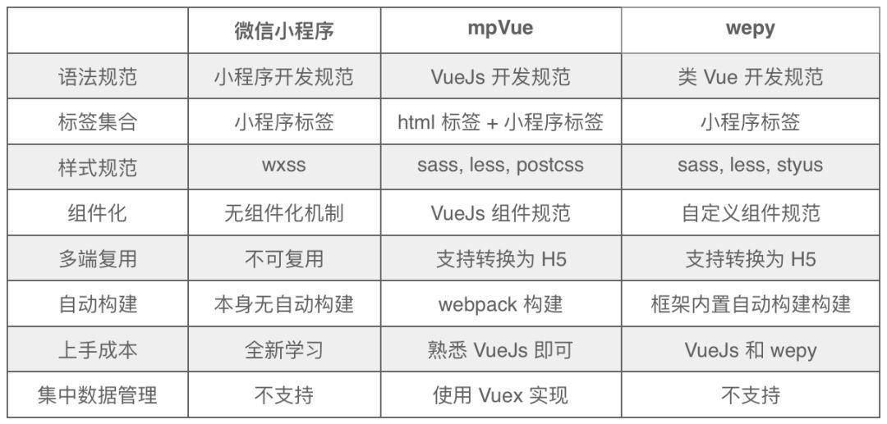

### 概述
工程化是我们长期以来对工作的积累的产物，帮助我们更快、更好、更高效的完成多样化的工作，我们工程化的主要目的在于：
+ 降低学习小程序开发门槛；
+ 提高代码的复用性；

### 框架选择
#### 1. mpvue

mpvue 是美团点评开源的一个使用 Vue.js 开发小程序的前端框架。框架基于 Vue.js 核心，mpvue 修改了 Vue.js 的 runtime 和 compiler 实现，使其可以运行在小程序环境中，从而为小程序开发引入了整套 Vue.js 开发体验。使用 mpvue 开发小程序，你将在小程序技术体系的基础上获取到这样一些能力：
+ 彻底的组件化开发能力：提高代码复用性
+ 完整的 Vue.js 开发体验
+ 方便的 Vuex 数据管理方案：方便构建复杂应用
+ 快捷的 webpack 构建机制：自定义构建策略、开发阶段 hotReload
+ 支持使用 npm 外部依赖
+ 使用 Vue.js 命令行工具 vue-cli 快速初始化项目
+ H5 代码转换编译成小程序目标代码的能力
+ 在未来最理想的状态是，可以一套代码可以直接跑在多端：WEB、小程序（微信和支付宝）、Native（借助weex）

#### 2. wepy

WePY 是一款让小程序支持组件化开发的框架，通过预编译的手段让开发者可以选择自己喜欢的开发风格去开发小程序。框架的细节优化，Promise，Async Functions 的引入都是为了能让开发小程序项目变得更加简单，高效。
特性：

+ 类 Vue 开发风格
+ 支持自定义组件开发
+ 支持引入 NPM 包
+ 支持 Promise
+ 支持 ES2015 + 特性，如 Async Functions
+ 支持多种编译器，Less/Sass/Styus、Babel/Typescript、Pug
+ 支持多种插件处理，文件压缩，图片压缩，内容替换等
+ 支持 Sourcemap，ESLint 等
+ 小程序细节优化，如请求列队，事件优化等
#### 3. 特性对比图

根据上图对比`mpVue`是我们最佳选择

### mpvue注意事项
##### 不支持 纯-HTML
程序里所有的 `BOM／DOM` 都不能用，也就是说 `v-html` 指令不能用。
##### 不支持部分复杂的 JavaScript 渲染表达式
我们会把 `template` 中的 `{{}}` 双花括号的部分，直接编码到 wxml 文件中，由于微信小程序的能力限制(数据绑定)，所以无法支持复杂的 JavaScript 表达式。

目前可以使用的有` + - * % ?: ! == === > < [] .`，剩下的还待完善。
```html
<!-- 这种就不支持，建议写 computed -->
<p>{{ message.split('').reverse().join('') }}</p>

<!-- 但写在 @event 里面的表达式是都支持的，因为这部分的计算放在了 vdom 里面 -->
<ul>
    <li v-for="item in list">
        <div @click="clickHandle(item, index, $event)">{{ item.value }}</p>
    </li>
</ul>
```
##### 不支持过滤器
渲染部分会转成 wxml ，wxml 不支持过滤器，所以这部分功能不支持。
##### 不支持函数
不支持在 template 内使用 methods 中的函数。
##### Class 与 Style 绑定
为节约性能，我们将 Class 与 Style 的表达式通过 compiler 硬编码到 wxml 中，支持语法和转换效果如下：

class 支持的语法:
```html
<p :class="{ active: isActive }">111</p>
<p class="static" v-bind:class="{ active: isActive, 'text-danger': hasError }">222</p>
<p class="static" :class="[activeClass, errorClass]">333</p>
<p class="static" v-bind:class="[isActive ? activeClass : '', errorClass]">444</p>
<p class="static" v-bind:class="[{ active: isActive }, errorClass]">555</p>
```
将分别被转换成:
```html
<view class="_p {{[isActive ? 'active' : '']}}">111</view>
<view class="_p static {{[isActive ? 'active' : '', hasError ? 'text-danger' : '']}}">222</view>
<view class="_p static {{[activeClass, errorClass]}}">333</view>
<view class="_p static {{[isActive ? activeClass : '', errorClass]}}">444</view>
<view class="_p static {{[[isActive ? 'active' : ''], errorClass]}}">555</view>
```
style 支持的语法:
```html
<p v-bind:style="{ color: activeColor, fontSize: fontSize + 'px' }">666</p>
<p v-bind:style="[{ color: activeColor, fontSize: fontSize + 'px' }]">777</p>
```
将分别被转换成:
```html
<view class="_p" style=" {{'color:' + activeColor + ';' + 'font-size:' + fontSize + 'px' + ';'}}">666</view>
<view class="_p" style=" {{'color:' + activeColor + ';' + 'font-size:' + fontSize + 'px' + ';'}}">777</view>
```
不支持 官方文档：Class 与 Style 绑定 中的 classObject 和 styleObject 语法。

最佳实践见上文支持的语法，从性能考虑，建议不要过度依赖此。

此外还可以用 computed 方法生成 class 或者 style 字符串，插入到页面中，举例说明：
```html
<template>
    <!-- 支持 -->
    <div class="container" :class="computedClassStr"></div>
    <div class="container" :class="{active: isActive}"></div>

    <!-- 不支持 -->
    <div class="container" :class="computedClassObject"></div>
</template>
<script>
    export default {
        data () {
            return {
                isActive: true
            }
        },
        computed: {
            computedClassStr () {
                return this.isActive ? 'active' : ''
            },
            computedClassObject () {
                return { active: this.isActive }
            }
        }
    }
</script>
```
[更多请查看使用手册](http://mpvue.com/mpvue/#_1)